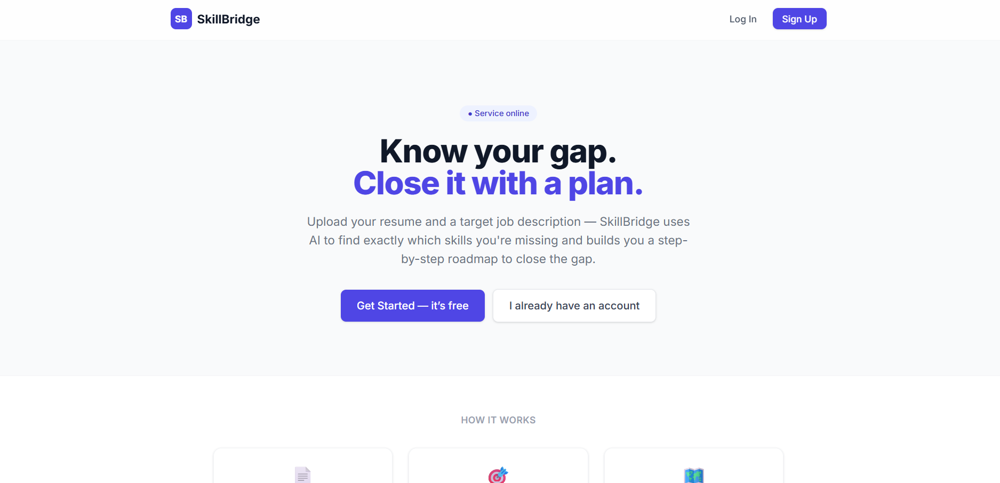
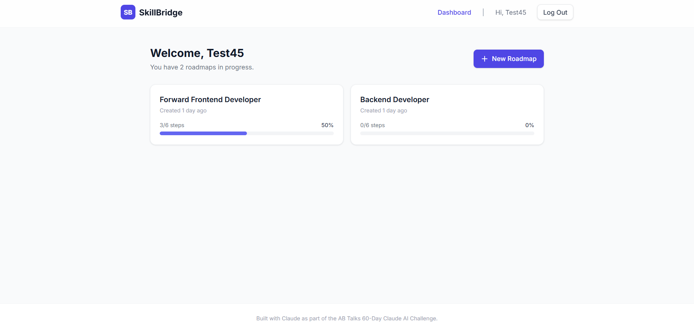
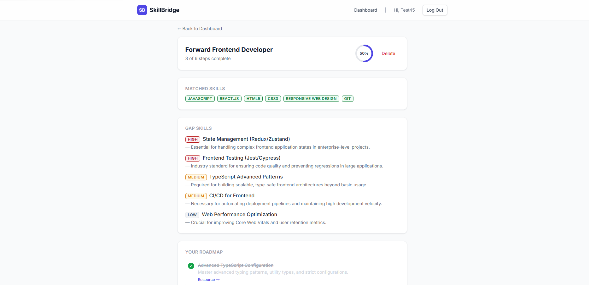

# SkillBridge

**Know your gap. Close it with a plan.**


SkillBridge is an AI-powered web app that compares your resume against a target job description, identifies exactly which skills you're missing, and generates a personalized, trackable learning roadmap to close that gap.

🔗 **Live app**: https://skill-bridge-frontend-1l8i.onrender.com


📂 **Repo**: https://github.com/srivastavarudresh552-cmyk/Skill-Bridge

---

## 📸 Screenshots

### Landing Page
The homepage where users can upload their resume and target job description to generate an AI-powered learning roadmap.



---

### Dashboard
The dashboard displays all generated roadmaps, their completion progress, and allows users to create new learning plans.



---

### Roadmap Details
Detailed roadmap view showing matched skills, identified skill gaps, prioritized learning recommendations, and interactive progress tracking.


## Features

- **AI-powered skill-gap analysis** — upload a resume (PDF) and a target job description; Gemini compares them and returns matched skills, prioritized gap skills, and a step-by-step roadmap.
- **Secure authentication** — JWT-based signup/login with bcrypt password hashing.
- **Progress tracking** — check off roadmap steps as you complete them; progress persists and shows on your dashboard.
- **Multiple roadmaps** — track skill gaps for more than one target role at once.
- **Fully responsive**, accessible (keyboard navigation, `prefers-reduced-motion` support, semantic markup), and production-hardened (rate limiting, input validation, session-expiry handling, offline detection).

## Tech Stack

| Layer | Technology |
|---|---|
| Frontend | React (Vite), Tailwind CSS, React Router, Axios |
| Backend | Node.js, Express, Mongoose |
| Database | MongoDB Atlas |
| Auth | JWT + bcrypt |
| AI | Google Gemini API (`gemini-3.1-flash-lite`) |
| Hosting | Render (Static Site + Web Service), both free tier |

Full architecture, schema, and API design docs are in [`/docs`](./docs).

## Getting Started Locally

See [`docs/SETUP.md`](./docs/SETUP.md) for full setup instructions, or the quick version:

```bash
git clone https://github.com/srivastavarudresh552-cmyk/Skill-Bridge.git
cd Skill-Bridge

# Backend
cd server
npm install
cp .env.example .env   # then fill in real values — see docs/ENVIRONMENT.md
npm run dev

# Frontend (new terminal)
cd client
npm install
# create client/.env — see docs/ENVIRONMENT.md
npm run dev
```

## Known Limitations

- Free-tier Render backend spins down after inactivity — first request after idle takes 30-60 seconds to wake up.
- No password reset flow (out of the original 10-day scope).
- No automated test suite — an explicitly scoped trade-off for a 10-day solo capstone, not an oversight.
- Gemini's free tier has rate limits; heavy concurrent usage may hit a temporary 429 (handled gracefully in the UI).

## Documentation

| Doc | Contents |
|---|---|
| [`ARCHITECTURE.md`](./docs/ARCHITECTURE.md) | System architecture, diagrams, request lifecycle |
| [`SCHEMA.md`](./docs/SCHEMA.md) | Database schema and design |
| [`API.md`](./docs/API.md) | Full API endpoint reference |
| [`UI-WIREFRAMES.md`](./docs/UI-WIREFRAMES.md) | User flow and wireframes |
| [`PROJECT-STRUCTURE.md`](./docs/PROJECT-STRUCTURE.md) | Folder structure and file responsibilities |
| [`SETUP.md`](./docs/SETUP.md) | Local development setup guide |
| [`ENVIRONMENT.md`](./docs/ENVIRONMENT.md) | Environment variables and hosting config |
| [`PROJECT-LOG.md`](./docs/PROJECT-LOG.md) | Day-by-day build log |
| [`challenge-retrospective.md`](./docs/challenge-retrospective.md) | Full build journey, decisions, and lessons learned |
| [`future-scope.md`](./docs/future-scope.md) | Where this project could go next |

## About This Project

Built as a 10-day capstone for the **AB Talks 60-Day Claude AI Challenge**, following a full SDLC: requirements → design → implementation → testing/hardening → launch.

## License

MIT — see [`LICENSE`](./LICENSE).
