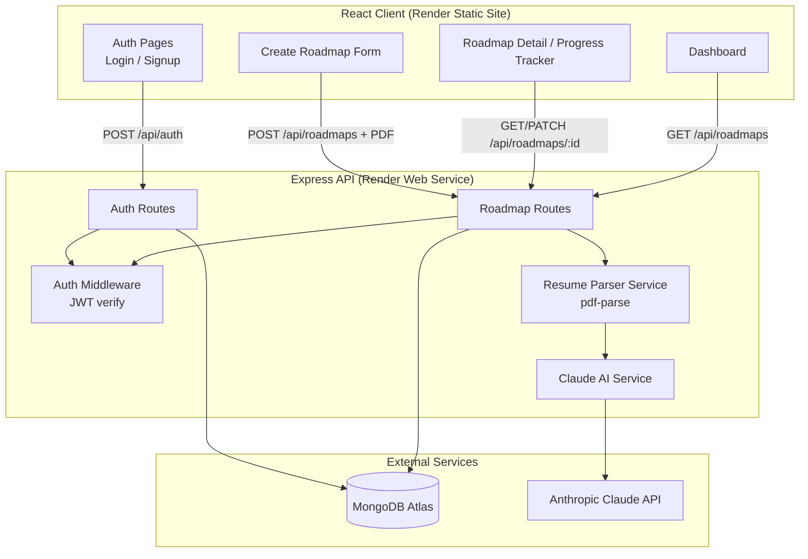
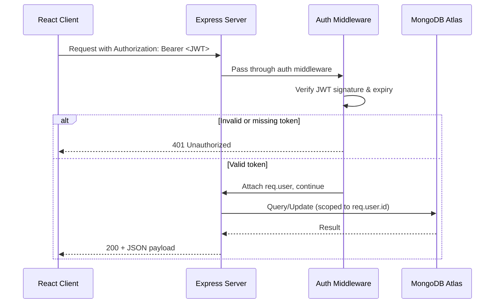

# SkillBridge — System Architecture

## 1. Overview

SkillBridge is a MERN application with a clear client–server split. The React client never talks to the Claude API directly — all AI calls are proxied through the Express backend so the API key never reaches the browser.

## 2. Component Diagram

## 3. Data Flow (Roadmap Creation)

```mermaid
flowchart LR
    U[User uploads resume PDF<br/>+ pastes target job description] --> S1[multer receives file]
    S1 --> S2[pdf-parse extracts resume text]
    S2 --> S3[Server builds prompt:<br/>resume text + job description]
    S3 --> S4[Claude API call]
    S4 --> S5[Claude returns structured<br/>gap analysis + roadmap JSON]
    S5 --> S6[Server validates & saves<br/>Roadmap document to MongoDB]
    S6 --> S7[Server responds to client<br/>with saved roadmap]
    S7 --> U2[Dashboard renders roadmap]
```

## 4. Request Lifecycle (Authenticated Request)

## 5. AI Interaction Detail

- The server, never the client, holds the `ANTHROPIC_API_KEY`.
- Prompt construction happens server-side in a dedicated `services/claudeService.js` module.
- The AI is asked to return **structured JSON only** (matched skills, gap skills, roadmap steps with order/priority) so the server can validate and store it directly into the `Roadmap` schema — no free-text parsing on the client.
- If Claude's response fails JSON validation, the server retries once with a stricter instruction, then falls back to a clear error message to the client (mitigates the PRD's "AI inconsistency" risk).

## 6. External Services

| Service | Role | Tier |
|---|---|---|
| MongoDB Atlas | Primary data store (Users, Roadmaps) | Free M0 cluster |
| Anthropic Claude API | Skill-gap analysis + roadmap generation | Pay-per-use (metered, low volume for a capstone) |
| Render (Web Service) | Hosts Express backend | Free |
| Render (Static Site) | Hosts React build | Free |

## 7. Why This Shape

- **Single backend, no microservices** — a 10-day capstone doesn't need the operational overhead of separate services; one Express app with clear internal module boundaries (`routes/controllers/services/models`) is enough and keeps deployment to one Render service.
- **AI calls isolated in a service layer** — makes it trivial to swap models or add retry/caching logic later without touching route or controller code.
- **JWT (stateless)** — no session store needed, which matters on a free-tier host with no persistent Redis/memory guarantee.
