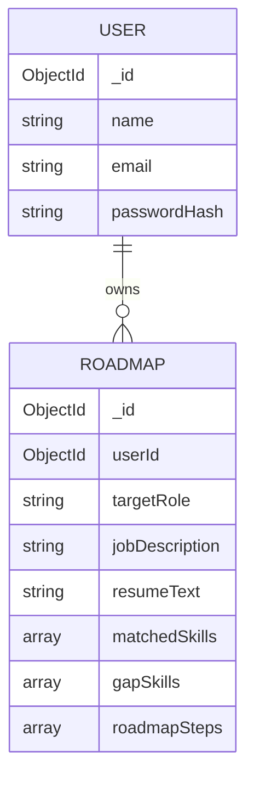

# SkillBridge — Database Schema (MongoDB / Mongoose)

Two collections, matching the PRD's Data Model (Section 11: User and Roadmap entities). No additional collections are introduced — this stays within approved scope.

## 1. `users` Collection

```js
{
  _id: ObjectId,
  name: String,          // required, min 2 chars
  email: String,         // required, unique, lowercase, valid email format
  passwordHash: String,  // required, bcrypt hash, never returned in API responses
  createdAt: Date,       // default: now
  updatedAt: Date        // default: now, auto-updated
}
```

**Constraints**
- `email`: unique index, required, validated format.
- `passwordHash`: required, minimum 8-character raw password enforced at validation layer (before hashing).
- `name`: required, 2–50 characters.

## 2. `roadmaps` Collection

```js
{
  _id: ObjectId,
  userId: ObjectId,        // required, ref: 'User', indexed
  targetRole: String,      // required, e.g. "Frontend Developer"
  jobDescription: String,  // required, raw pasted text
  resumeText: String,      // required, extracted from uploaded PDF via pdf-parse
  matchedSkills: [String], // AI-generated: skills user already has that match the role
  gapSkills: [
    {
      skill: String,       // required
      priority: String,    // enum: "high" | "medium" | "low"
      reason: String       // short AI-generated justification
    }
  ],
  roadmapSteps: [
    {
      stepId: String,      // required, unique within array (uuid or index-based)
      title: String,       // required
      description: String,
      resourceLinks: [String], // optional, AI-suggested learning resources
      completed: Boolean,  // default: false — this is the "progress tracking" field
      order: Number         // required, defines sequence in the roadmap
    }
  ],
  createdAt: Date,         // default: now
  updatedAt: Date          // default: now, auto-updated
}
```

**Constraints**
- `userId`: required, indexed (all roadmap queries are scoped by user).
- `targetRole`, `jobDescription`, `resumeText`: required — a roadmap cannot exist without the inputs that generated it.
- `roadmapSteps[].completed`: defaults to `false`; only field mutable via the progress-tracking endpoint.
- A user can have **many** roadmap documents (Multi-Role Support — PRD Scope item).

## 3. Relationship



One-to-many: one `User` owns zero or more `Roadmap` documents. Roadmap steps and gap skills are embedded (not separate collections) since they're always accessed together with their parent roadmap and never queried independently — this avoids unnecessary joins on a free-tier cluster.

## 4. Validation Against PRD User Stories

| User Story (from Core User Flow, PRD §7) | Schema Support |
|---|---|
| Signup / Login | `users` collection with unique email + hashed password |
| Submit resume + target job description | `resumeText`, `jobDescription`, `targetRole` fields on `Roadmap` |
| Receive AI skill-gap analysis | `matchedSkills`, `gapSkills` fields |
| Receive personalized learning roadmap | `roadmapSteps` array |
| Save roadmap to dashboard | Every `Roadmap` is persisted on creation, queryable by `userId` |
| Track progress (mark skills learned) | `roadmapSteps[].completed` boolean, updated via PATCH |
| Maintain multiple roadmaps for different roles | Many `Roadmap` docs per `userId`, no uniqueness constraint on `targetRole` |

Every functional requirement in PRD §8 maps to a field above — no gaps found, no schema changes needed beyond this design.
