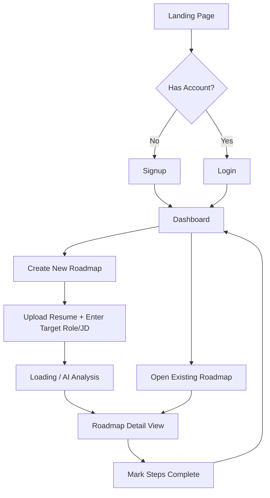

# SkillBridge — UI & User Flow

## 1. User Flow Diagram



## 2. Screens (every screen exists for a reason)

| Screen | Purpose | PRD Traceability |
|---|---|---|
| Landing Page | Entry point, explains value prop, routes to Login/Signup | First touchpoint, required for any unauthenticated visitor |
| Signup | Create account | PRD §8 Authentication |
| Login | Authenticate returning user | PRD §8 Authentication |
| Dashboard | List all of the user's roadmaps, entry to create new one | PRD §5 Save & Dashboard, Multi-Role Support |
| Create Roadmap | Upload resume PDF + paste target job description | PRD §5 Resume Input, Target Role Input |
| Loading / Analysis | Shows progress while Claude generates the roadmap | Manages the async AI call so users know it's working, not frozen |
| Roadmap Detail | Shows matched skills, gap skills, and the step-by-step roadmap with checkboxes | PRD §5 AI Analysis, Learning Roadmap, Progress Tracking |

No admin panel, no settings screen, no notifications screen — all correctly excluded per PRD §6 Out of Scope.

## 3. Low-Fidelity Wireframes (ASCII)

### Dashboard
```
+--------------------------------------------------+
| SkillBridge          [Profile ▾]                 |
+--------------------------------------------------+
| My Roadmaps                     [+ New Roadmap]   |
|                                                    |
|  +----------------------+  +----------------------+
|  | Frontend Developer   |  | Data Analyst         |
|  | 6/10 steps complete  |  | 2/8 steps complete   |
|  | [View Roadmap]       |  | [View Roadmap]       |
|  +----------------------+  +----------------------+
+--------------------------------------------------+
```

### Create Roadmap
```
+--------------------------------------------------+
| < Back to Dashboard                               |
+--------------------------------------------------+
| Target Role: [ Frontend Developer______________ ] |
|                                                    |
| Job Description:                                  |
| [                                                ] |
| [   (paste job posting text here)               ] |
| [                                                ] |
|                                                    |
| Resume: [ Choose File ]  resume_jane.pdf uploaded  |
|                                                    |
|              [ Generate Roadmap ]                 |
+--------------------------------------------------+
```

### Roadmap Detail
```
+--------------------------------------------------+
| < Back to Dashboard         Frontend Developer     |
+--------------------------------------------------+
| Matched Skills: React, Git, HTML/CSS               |
|                                                    |
| Gap Skills (Priority):                            |
|  [HIGH] TypeScript                                 |
|  [MED]  Testing (Jest)                             |
|  [LOW]  CI/CD basics                               |
|                                                    |
| Your Roadmap:                                      |
|  [x] 1. Learn TypeScript fundamentals              |
|  [x] 2. Convert one project to TypeScript          |
|  [ ] 3. Write unit tests with Jest                 |
|  [ ] 4. Set up a basic GitHub Actions pipeline      |
+--------------------------------------------------+
```

## 4. Navigation Rules

- Unauthenticated users can only reach Landing, Login, Signup — any other route redirects to Login.
- Dashboard is the "home base" after login; every other authenticated screen has a clear path back to it.
- No deep nested navigation — max 2 levels deep (Dashboard → Roadmap Detail), matching a 10-day scope.
